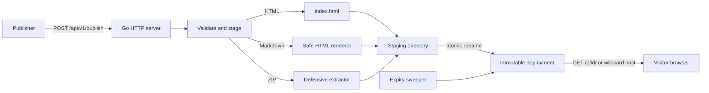

# Architecture

Tabucom is a single Go HTTP service backed by the local filesystem or optional S3-compatible object storage. It accepts already-built static content, publishes it atomically, serves it until expiry, and removes it in the background. There is no database, queue, external cache, or uploaded-code execution.

## System overview



The executable in `cmd/tabucom` loads configuration, creates the server, and manages graceful shutdown. The `internal/server` package owns routing, publication, storage, static serving, expiry, rate limiting, and embedded discovery pages.

## Publish lifecycle

1. `POST /api/v1/publish` is rate-limited by the request's network peer.
2. The server validates `Content-Type`, `spa`, `ttl`, optional password settings, and request-size limits.
3. A random UUID and a temporary directory are created under `DATA_DIR/sites`.
4. HTML is streamed to `index.html`, Markdown is rendered to escaped HTML, or a ZIP is defensively extracted. Every input must produce a regular root `index.html`.
5. The server writes private metadata containing creation time, expiry, file count, byte count, SPA behavior, and optional Argon2id password data. Plaintext passwords are never stored.
6. The staging directory is renamed to its final UUID. Because both paths share a parent filesystem, a deployment becomes visible atomically.
7. The API returns `201` with `url`, `expiresAt`, `protected`, and the password when protection was requested.

Failures remove the staging directory, so visitors cannot observe partial deployments. Published directories are never modified.

## Storage model

```text
DATA_DIR/
└── sites/
    ├── .staging-*/           temporary, never served
    └── <deployment-uuid>/
        ├── .site.json        private metadata
        ├── index.html
        └── ...               uploaded static assets
```

Local storage remains the default and requires a persistent volume across container restarts. Setting `S3_BUCKET` stores committed deployment files in S3-compatible object storage instead; temporary validation and ZIP extraction still use `DATA_DIR`. S3 files are uploaded before `.site.json`, which acts as the visibility marker because object stores do not provide atomic directory rename. Incomplete prefixes remain invisible and are removed after one hour.

At startup and every `SWEEP_INTERVAL`, the server removes expired deployments, deployments with unreadable metadata, abandoned staging directories, and stale rate-limit buckets. Expired sites also fail closed at request time, so cleanup timing cannot extend their availability.

## Serving deployments

Path mode serves deployments from `/p/{id}/`. When `PREVIEW_DOMAIN` is set, `{id}.<preview-domain>` is used instead and is routed as a static-only origin before API routes.

Only regular files are served. Directory requests resolve to `index.html`; SPA deployments additionally fall back to the root `index.html` for missing extensionless `GET` requests. Cache lifetimes are capped at five minutes and never cross deployment expiry.

Protected deployments authorize before local-file or S3-object resolution. Unauthenticated requests receive a no-store password form; successful submissions set an HttpOnly, host-only, deployment-scoped cookie that expires with the deployment. Protected content is private and not cached. Password submissions are limited to 10 per minute per deployment and network peer. Production password protection requires HTTPS.

The landing page, OpenAPI document, `llms.txt`, and agent metadata are embedded into the binary and exposed through an explicit route allowlist.

## Security boundaries

- Uploaded content is data: the server never invokes an interpreter, package manager, or build tool.
- ZIP entries are rejected for traversal, absolute paths, duplicate normalized names, path conflicts, excessive depth, symlinks, and special files. Compressed size, expanded size, and entry count are bounded.
- Metadata is not addressable from deployment URLs.
- Publication is unauthenticated by design. Network ingress must provide access control.
- In path mode, uploaded pages share the service origin. Wildcard mode should be used when browser-origin isolation is required.
- Client IP rate limits use the direct socket address and do not trust forwarded-address headers.

## Design constraints

Changes should preserve four core properties: uploaded code is never executed, deployments are immutable, visibility is atomic, and expiry is enforced while serving as well as during cleanup. API, landing-page examples, OpenAPI, `llms.txt`, and agent discovery metadata must remain synchronized when behavior changes.
